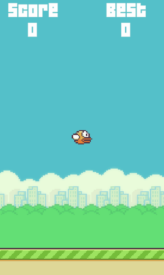

# Flappy Bird Clone (Unity)

## Overview
A robust recreation of the classic "Flappy Bird" arcade game, developed using the Unity engine. This project focuses on implementing clean mechanics, responsive physics, and modular code architecture. It serves as a practical demonstration of 2D game development fundamentals, UI management, and state control in Unity.

## 🚀 Key Features
* **Modern Input Handling:** Utilizes Unity's new `InputSystem` for highly responsive and optimized player controls.
* **Physics-Driven Animation:** The bird's rotation is dynamically calculated in `FixedUpdate` based on its vertical velocity (`Rigidbody2D`), creating a natural and satisfying visual feel.
* **Procedural Obstacles:** A timer-based spawning system generates pipes at randomized heights, with automatic memory cleanup (destroying assets that leave the screen).
* **Seamless Environment:** Implemented an infinite scrolling ground effect using `SpriteRenderer` size manipulation, providing a smooth parallax illusion without moving multiple objects.
* **Persistent Progression:** Real-time score tracking with local high-score persistence using `PlayerPrefs`.

## ⚙️ Technical Architecture
The codebase is structured to maintain readability and separation of concerns:
* **Singleton Pattern:** Used for global managers (`GameManager`, `Score`) to efficiently handle game states, UI updates.
* **Component-Based Design:** Distinct responsibilities are isolated into specific scripts (e.g., `FlyBehavior` strictly handles player physics, `MovePipe` handles obstacle translation, and `PipeIncreaseScore` manages trigger events).
* **UI Integration:** Built with `TextMeshPro` for crisp, scalable score rendering.

## 🛠️ Built With
* **Engine:** Unity (6000.4.6f1)
* **Language:** C#
* **Dependencies:** Unity Input System, TextMeshPro
